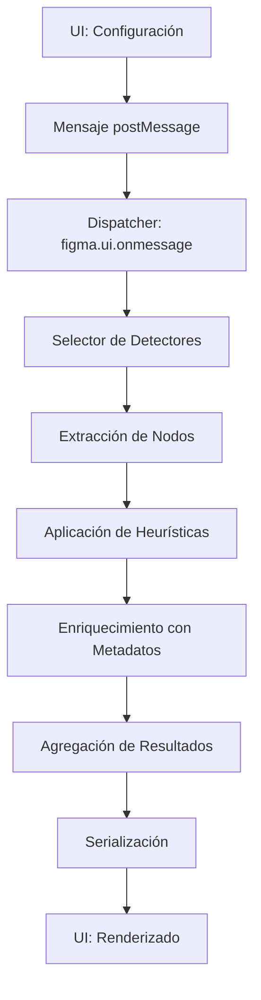

# Arquitectura del Sistema

## Visión General

Simple Smells Detector implementa una **arquitectura de tres capas** que separa claramente las responsabilidades de presentación, lógica de negocio y acceso a datos, siguiendo principios de diseño modular que facilitan mantenibilidad y extensibilidad.

```
┌─────────────────────────────────────────────────┐
│                UI Layer                         │
│  (ui.html + JavaScript embebido)               │
├─────────────────────────────────────────────────┤
│              Analysis Engine                    │
│  ┌─────────────┬─────────────┬─────────────┐   │
│  │    Core     │  Detectors  │ Utilities   │   │
│  │             │             │             │   │
│  └─────────────┴─────────────┴─────────────┘   │
├─────────────────────────────────────────────────┤
│              API Adapter                        │
│        (Figma Plugin API)                       │
└─────────────────────────────────────────────────┘
```

## Capas del Sistema

### 🎨 Capa de Presentación (UI Layer)

**Archivo Principal**: `ui.html` con JavaScript embebido

**Responsabilidades**:
- Gestión de interacciones de usuario
- Renderizado de resultados y métricas
- Configuración de parámetros y presets
- Exportación de datos (CSV/Markdown)

**Patrones Implementados**:
- **Model-View-Controller** simplificado
- **Observer Pattern** para comunicación asíncrona con el engine

**Tecnologías**:
- HTML5 + CSS3 + JavaScript ES6+
- Sistema de pestañas nativo
- Responsive design para diferentes tamaños de ventana

### ⚙️ Capa de Lógica de Negocio (Analysis Engine)

**Archivo Principal**: `code.js` como coordinador + módulos especializados

**Estructura Modular**:

```
analysis-engine/
├── core/                    # Componentes centrales
│   ├── runner.js           # Coordinador de ejecución
│   ├── registry.js         # Registro de detectores
│   └── normalizer.js       # Normalización de datos
├── detectors/              # Implementación de detectores
│   ├── sizeDetector.js     # S01: Análisis de tamaños
│   ├── consistencyDetector.js # S02: Consistencia dimensional
│   ├── formatDetector.js   # S03: Campos sin formato
│   ├── linkDetector.js     # S04: Enlaces confusos
│   ├── valuesDetector.js   # S05: Valores limitados
│   ├── complexityDetector.js # S06: Complejidad de formularios
│   └── flowDetector.js     # S07: Flujos extensos
└── utilities/              # Utilidades compartidas
    ├── geometry.js         # Cálculos geométricos
    ├── semantics.js        # Análisis semántico
    ├── grouping.js         # Agrupación de elementos
    └── flows.js            # Análisis de flujos
```

**Patrones Implementados**:
- **Strategy Pattern**: Detectores intercambiables
- **Chain of Responsibility**: Procesamiento secuencial
- **Factory Pattern**: Creación de detectores
- **Registry Pattern**: Gestión de detectores disponibles

### 🔌 Capa de Acceso a Datos (API Adapter)

**Componente Principal**: Abstracción sobre Figma Plugin API

**Responsabilidades**:
- Extracción de elementos del diseño
- Normalización de datos de nodos
- Persistencia de configuraciones (`figma.clientStorage`)
- Gestión del sistema de ignorados (`figma.setPluginData`)

**Patrones Implementados**:
- **Adapter Pattern**: Encapsulación de API externa
- **Repository Pattern**: Gestión de configuraciones

## Flujo de Ejecución

### Pipeline de Procesamiento



### Secuencia Detallada

1. **Iniciación**: Interface captura parámetros y scope
2. **Comunicación**: Mensaje estructurado transporta configuración
3. **Orquestación**: Dispatcher interpreta solicitud y selecciona detectores
4. **Extracción**: Algoritmos especializados recorren árbol de nodos
5. **Análisis**: Cada detector aplica heurísticas específicas
6. **Enriquecimiento**: Función `withFrameInfo` añade metadatos contextuales
7. **Agregación**: Findings normalizados se consolidan
8. **Presentación**: Interface renderiza con capacidades de filtrado

## Componentes Transversales

### Sistema de Persistencia

**Configuraciones Globales**:
```javascript
// figma.clientStorage
{
  settings: {
    UMBRAL_CAMPOS_FORMULARIO: 8,
    MAX_DISTANCIA_VERTICAL: 40,
    // ...
  },
  customDataTypes: { /* ... */ },
  industryPresets: { /* ... */ }
}
```

**Sistema de Ignorados**:
```javascript
// figma.setPluginData por nodo
{
  "ux-ignored-SEMANTIC": {
    timestamp: "2024-12-30T...",
    reason: "User decision"
  }
}
```

### Normalización Textual

**Función Central**: `normalizarTexto()`

**Capacidades**:
- Eliminación de diacríticos
- Normalización de case
- Limpieza de caracteres especiales
- Soporte multiidioma (ES/EN)

```javascript
function normalizarTexto(texto) {
  return texto
    .toLowerCase()
    .normalize('NFD')
    .replace(/[\u0300-\u036f]/g, '')
    .trim();
}
```

## Extensibilidad

### Interface de Detector

Todos los detectores implementan una interface estándar:

```javascript
class BaseDetector {
  constructor(settings = {}) {
    this.settings = settings;
  }
  
  async analyze(nodes, context) {
    // Implementación específica
    return findings;
  }
  
  getMetadata() {
    return {
      id: 'detector-id',
      name: 'Detector Name',
      description: 'Description',
      category: 'category'
    };
  }
}
```

### Sistema de Registro

```javascript
// registry.js
const DETECTOR_REGISTRY = new Map([
  ['size', new SizeDetector()],
  ['consistency', new ConsistencyDetector()],
  // ...
]);
```

### Configuración Dinámica

```javascript
// Tipos de datos personalizados
const CUSTOM_DATA_TYPE = {
  keywords: ['custom', 'field'],
  minWidth: 100,
  maxWidth: 200,
  mensaje: 'Custom validation message',
  requiresComponent: false
};
```

## Consideraciones de Performance

### Optimizaciones Implementadas

1. **Cache de Asociaciones**: Reutilización de mapeos label → tipo
2. **Early Exit**: Salida temprana para nodos sin contexto válido
3. **Memoización**: Cache de cálculos geométricos complejos
4. **Procesamiento Lazy**: Análisis bajo demanda por detector

### Complejidad Algorítmica

| Detector | Complejidad | Optimización |
|----------|-------------|--------------|
| S01 | O(n) + asociación semántica | Cache de labels |
| S02 | O(n log n) | Memoización geométrica |
| S03 | O(n) | Early exit sin labels |
| S04 | O(t) donde t = texto | Separación de diccionarios |
| S05 | O(n × k) | Estructura trie para matching |
| S06 | O(n log n) | Agrupación espacial optimizada |
| S07 | O(r + e) | BFS optimizado |

## Escalabilidad

### Manejo de Archivos Grandes

- **Procesamiento en chunks**: División de nodos en lotes
- **Timeouts**: Prevención de bloqueo de UI
- **Progress feedback**: Indicadores de progreso en tiempo real

### Límites y Restricciones

- **Nodos máximos**: ~10,000 nodos por análisis
- **Tiempo máximo**: 30 segundos por detector
- **Memoria**: Límites del contexto de plugin de Figma

## Patrones de Diseño Aplicados

### Creacionales
- **Factory**: Creación dinámica de detectores
- **Builder**: Construcción de findings complejos

### Estructurales
- **Adapter**: Abstracción de Figma API
- **Facade**: Simplificación de la interface pública
- **Composite**: Composición de detectores

### Comportamentales
- **Strategy**: Algoritmos de detección intercambiables
- **Observer**: Comunicación UI-Engine
- **Chain of Responsibility**: Pipeline de procesamiento
- **Command**: Encapsulación de operaciones de análisis

## Seguridad y Privacidad

### Manejo de Datos
- **Local only**: Ningún dato sale del contexto de Figma
- **Persistencia segura**: Uso de APIs oficiales de Figma
- **Anonimización**: No se almacenan datos sensibles

### Validación de Entrada
- **Sanitización**: Limpieza de strings de entrada
- **Validación de tipos**: Verificación de estructura de datos
- **Límites**: Prevención de ataques de recursos

---

**Ver también**:
- [Detectores](detectors.md) - Especificación de cada detector
- [API](api.md) - Documentación de la API interna
- [Desarrollo](development.md) - Guía para contribuidores